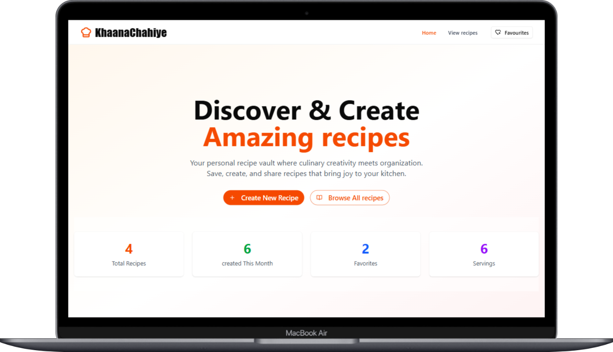
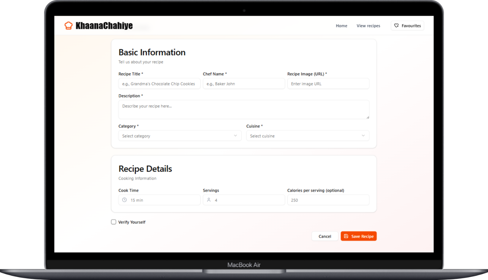
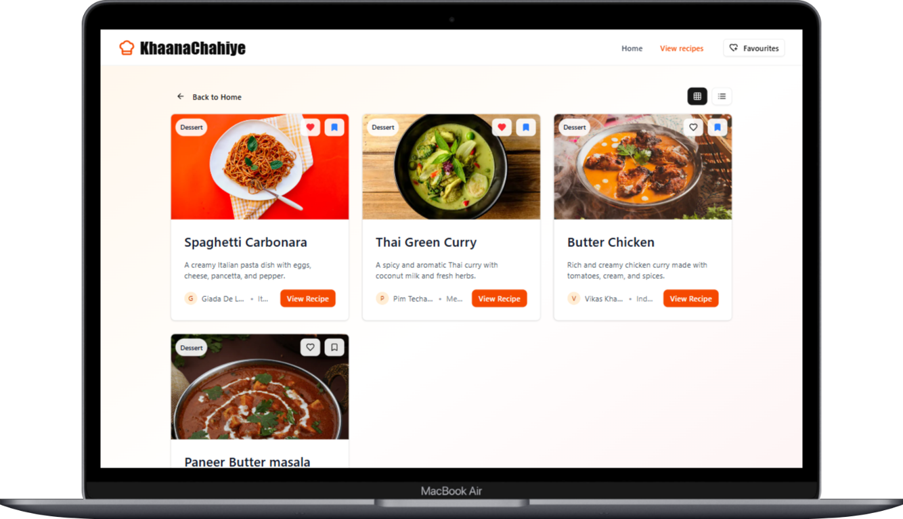
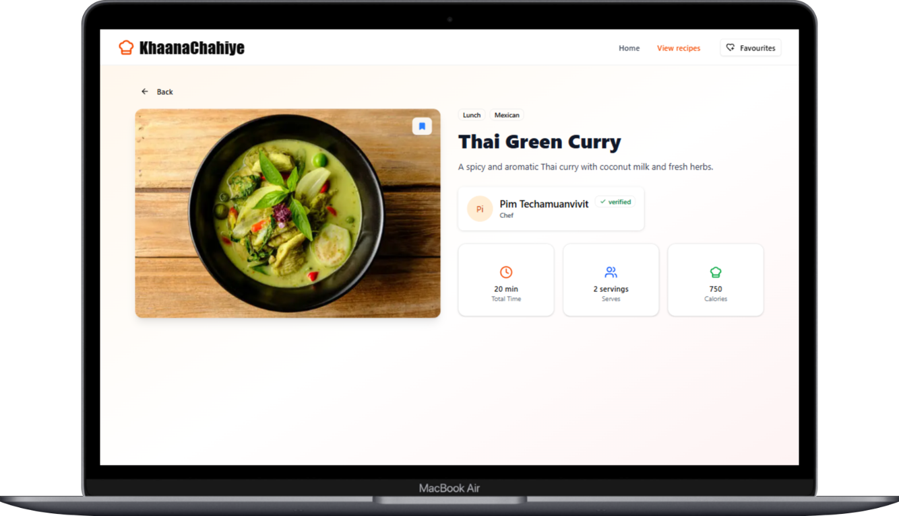
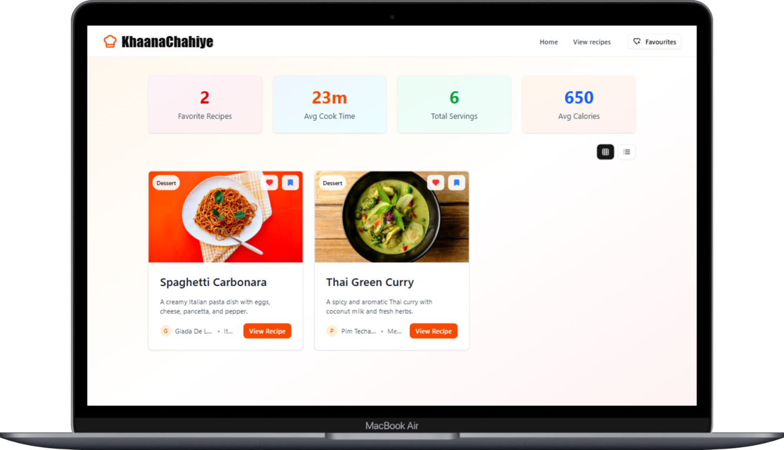

# 🍳 FlavorNest

_A delightful and modern recipe manager to create, explore, and favorite recipes._

---

## 🚀 Live Demo

<a href="https://flavournest1.vercel.app/" target="_blank" rel="noopener noreferrer">👉 Check it out here</a>

---

## 📸 Screenshots

### 🏠 Landing Page



---

### 📝 Create Recipe Form



---

### 📋 Recipe List View


---

### 🧱 Recipe Grid View



---

### 🔍 Recipe Detail Page



---

### ❤️ Favorite Recipes Page



---

## 🧠 Features

- 🏡 **Beautiful Landing Page** – Clean, modern, and responsive.
- 📋 **List & Grid View** – Toggle seamlessly between list and grid formats to browse recipes.
- 🍲 **Create Recipes** – Easily add your own recipes with validations.
- 📖 **Detailed Recipe View** – View full details of any recipe on a dedicated page.
- ⭐ **Bookmark & Favorite Recipes** – Save your favorite dishes with a single click.
- ❤️ **Favorites List Page** – Quickly access all your saved favorites.
- 📦 **State Management with Context API** – Smooth global state handling.
- 💅 **Modern UI Components** – Built using Tailwind CSS and ShadCN.
- 🧰 **Form Handling** – Validations handled via `react-hook-form`.

---

## 🔧 Tech Stack

| Tech                                                 | Description                              |
| ---------------------------------------------------- | ---------------------------------------- |
| [React.js](https://reactjs.org/)                     | Component-based UI development           |
| [Vite](https://vitejs.dev/)                          | Fast and modern build tool               |
| [Tailwind CSS](https://tailwindcss.com/)             | Utility-first CSS framework              |
| [ShadCN](https://ui.shadcn.dev/)                     | Accessible, reusable component library   |
| [React Router](https://reactrouter.com/)             | Declarative client-side routing          |
| [react-hook-form](https://react-hook-form.com/)      | Efficient form management and validation |
| [Context API](https://reactjs.org/docs/context.html) | Built-in state management                |

---

## 🛠️ Installation

```bash
# Clone the repository
git clone https://github.com/keshav7662/FlavorNest.git

# Navigate into the project directory
cd flavornest

# Install dependencies
npm install

# Start the development server
npm run dev
```
